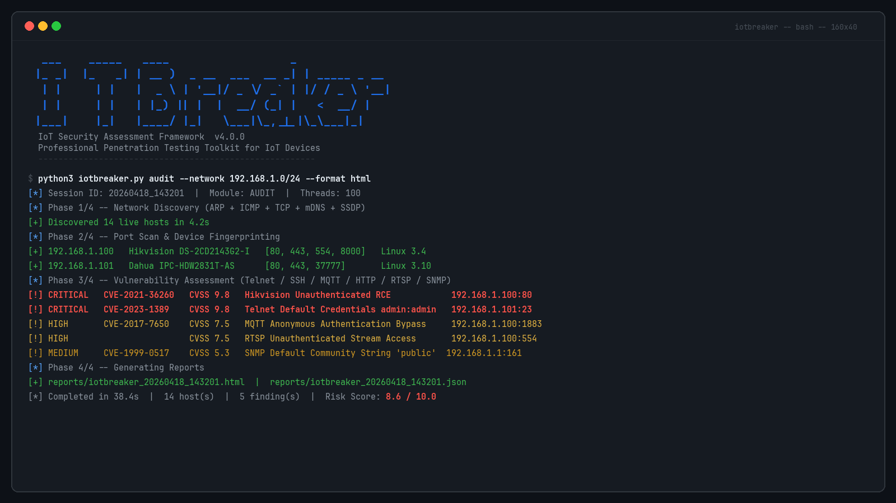

<div align="center">


# IoTBreaker

**IoT Security Assessment Framework**

*Professional Penetration Testing Toolkit for IoT Devices*

---

[](https://github.com/servais1983/IoTBreaker/releases)
[](https://www.python.org/)
[](LICENSE)
[](https://github.com/servais1983/IoTBreaker)
[](https://github.com/servais1983/IoTBreaker)
[](https://github.com/servais1983/IoTBreaker)
[](https://www.first.org/cvss/)
[](https://nvd.nist.gov/)

</div>

---

> **Legal Disclaimer.** IoTBreaker is designed exclusively for authorized security assessments, penetration testing engagements, and academic research. Use of this tool against systems without explicit written authorization from the system owner is illegal and strictly prohibited. The authors assume no liability for misuse or damage caused by this software.

---

## Overview

IoTBreaker is a professional-grade, modular penetration testing framework purpose-built for IoT infrastructure. It consolidates device discovery, port scanning, protocol-level vulnerability assessment, credential auditing, CVE exploitation, firmware analysis, and executive reporting into a single coherent command-line interface.

The framework targets the full attack surface of IoT deployments: IP cameras, NVRs, routers, smart home hubs, industrial controllers, MQTT brokers, and any networked embedded device. It integrates directly with the NIST National Vulnerability Database (NVD API v2.0) and the Shodan search engine to correlate live findings with known CVE records and external exposure data.

<div align="center">

</div>

---

## Architecture

<div align="center">

</div>

IoTBreaker follows a strict separation of concerns. The entry point (`iotbreaker.py`) parses arguments and delegates to the central `Engine`, which orchestrates module execution, session management, and result aggregation. Each functional capability lives in an isolated module under `modules/`, communicating with the engine through a standardized findings interface.

```
IoTBreaker/
├── iotbreaker.py               # CLI entry point (argparse, 10 subcommands)
├── core/
│   ├── engine.py               # Central orchestration engine
│   ├── config.py               # YAML + environment variable configuration
│   ├── logger.py               # Structured logging (DEBUG/INFO/WARNING/ERROR)
│   └── output.py               # Console rendering (tables, banners, progress)
├── modules/
│   ├── discovery/
│   │   ├── discovery.py        # ARP, ICMP, TCP, mDNS, SSDP/UPnP sweep
│   │   └── shodan_intel.py     # Shodan API integration
│   ├── scanner/
│   │   └── portscan.py         # Multi-threaded port scanner with banner grabbing
│   ├── fingerprint/
│   │   └── fingerprint.py      # OUI, HTTP headers, UPnP XML, SNMP sysDescr
│   ├── vulnscan/
│   │   ├── vulnscan.py         # Protocol vulnerability checks (CVSS v3.1)
│   │   └── cve_lookup.py       # NIST NVD API v2.0 CVE search
│   ├── bruteforce/
│   │   └── bruteforce.py       # Multi-protocol credential brute-force
│   ├── exploit/
│   │   └── exploit.py          # CVE proof-of-concept exploit modules
│   ├── firmware/
│   │   └── firmware.py         # Static firmware analysis
│   └── reporting/
│       └── report.py           # HTML / JSON / PDF / TXT report generation
├── wordlists/
│   ├── users.txt               # IoT-specific username list
│   ├── passwords.txt           # IoT default credential list
│   └── web_paths.txt           # Common IoT web interface paths
└── reports/                    # Output directory for generated reports
```

---

## Capabilities

### Discovery and Scanning

| Module | Method | Description |
|---|---|---|
| `discover` | ARP broadcast | Layer-2 host enumeration on local segments |
| `discover` | ICMP echo | ICMP ping sweep with TTL analysis |
| `discover` | TCP SYN probe | Stealthy host detection via TCP handshake |
| `discover` | mDNS/Bonjour | Service discovery on `.local` domains |
| `discover` | SSDP/UPnP | IoT device announcement capture |
| `scan` | TCP connect | Full-connect port scan with configurable thread count |
| `scan` | Banner grabbing | Raw service banner extraction per open port |
| `fingerprint` | OUI lookup | Vendor identification from MAC address |
| `fingerprint` | HTTP analysis | Server header, title, and form extraction |
| `fingerprint` | UPnP XML | Device description XML parsing |
| `fingerprint` | SNMP sysDescr | OID 1.3.6.1.2.1.1.1.0 system description |

### Vulnerability Assessment

IoTBreaker checks the following protocols and services for known misconfigurations and vulnerabilities, assigning a CVSS v3.1 base score to each finding:

| Protocol | Port(s) | Checks Performed |
|---|---|---|
| Telnet | 23 | Open access, default credentials, banner disclosure |
| SSH | 22 | Weak algorithms, default credentials, version disclosure |
| MQTT | 1883, 8883 | Anonymous authentication, unencrypted transport |
| HTTP/HTTPS | 80, 443, 8080, 8443 | Default credentials, exposed admin panels, path traversal |
| RTSP | 554, 8554 | Unauthenticated stream access, credential bypass |
| CoAP | 5683 | Unauthenticated resource access |
| UPnP | 1900 | SOAP injection, device information disclosure |
| SNMP | 161 | Default community strings (public/private), v1/v2c usage |
| FTP | 21 | Anonymous login, default credentials, banner disclosure |
| Modbus | 502 | Unauthenticated read/write access |

### CVE Exploit Modules

Each exploit module includes a `--check` mode (safe, read-only verification) and an `--exploit` mode (active payload delivery, requires explicit authorization).

| CVE | Affected Product | CVSS | Vector |
|---|---|---|---|
| CVE-2021-36260 | Hikvision IP Camera / DVR / NVR | 9.8 | Unauthenticated RCE via `/SDK/webLanguage` |
| CVE-2018-10562 | Dasan GPON Home Router | 9.8 | Command injection via `ping` parameter |
| CVE-2017-17215 | Huawei HG532 Router | 8.8 | UPnP SOAP NewStatusURL command injection |
| CVE-2014-8361 | Realtek SDK miniigd | 9.8 | UPnP SOAP NewInternalClient RCE |
| CVE-2016-6277 | NETGEAR R7000 / R6400 | 9.8 | Unauthenticated command injection |
| CVE-2020-25506 | D-Link DNS-320 NAS | 9.8 | Unauthenticated RCE via `system_mgr.cgi` |
| CVE-2022-30525 | Zyxel USG FLEX / ATP / VPN | 9.8 | OS command injection via `/ztp/cgi-bin/handler` |
| CVE-2023-1389 | TP-Link Archer AX21 | 8.8 | Command injection via locale API |
| CVE-2019-7192 | QNAP NAS Photo Station | 9.8 | Privilege escalation leading to RCE |

### Intelligence Integration

| Source | Integration | Data Retrieved |
|---|---|---|
| NIST NVD | REST API v2.0 | CVE ID, CVSS score, description, affected products |
| Shodan | Search API | Open ports, banners, geolocation, historical data |

### Reporting

IoTBreaker generates structured reports in four formats. Every report includes an executive summary, a risk score (0–10), a per-finding breakdown with CVSS scores, and remediation recommendations.

| Format | Use Case |
|---|---|
| HTML | Interactive browser report with color-coded severity levels |
| JSON | Machine-readable output for SIEM/ticketing system integration |
| PDF | Formal deliverable for client reporting |
| TXT | Plain-text log for archival and diff comparison |

---

## Installation

**Requirements:** Python 3.9 or later, Linux or macOS.

```bash
# Clone the repository
git clone https://github.com/servais1983/IoTBreaker.git
cd IoTBreaker

# Install Python dependencies
pip3 install -r requirements.txt

# Optional: configure API keys
cp env.example .env
# Edit .env and add your Shodan API key and NVD API key
```

**Dependencies overview:**

| Package | Purpose |
|---|---|
| `requests` | HTTP client for API calls and web checks |
| `scapy` | ARP/ICMP/TCP packet crafting for discovery |
| `paramiko` | SSH protocol interaction |
| `paho-mqtt` | MQTT client for broker checks |
| `python-nmap` | nmap subprocess wrapper (optional, enhances scan accuracy) |
| `shodan` | Official Shodan Python client |
| `pyyaml` | YAML configuration file parsing |
| `fpdf2` | PDF report generation |
| `jinja2` | HTML report templating |
| `colorama` | Cross-platform terminal color output |

---

## Usage

### Quick Reference

```
usage: iotbreaker [-h] [--version] [--verbose] [--output DIR]
                  [--format {json,html,pdf,all}] [--timeout SECONDS]
                  [--threads N] [--no-banner] [--config FILE]
                  <module> ...

Modules:
  discover      Network host discovery
  scan          Port scanning and banner grabbing
  fingerprint   Device fingerprinting and identification
  vuln          Protocol vulnerability assessment
  brute         Credential brute-force
  exploit       CVE exploit verification and execution
  firmware      Static firmware analysis
  shodan        Shodan intelligence lookup
  cve           CVE database search (NIST NVD)
  audit         Full automated assessment pipeline
```

### Common Workflows

**Full automated audit of a network segment:**
```bash
python3 iotbreaker.py audit --network 192.168.1.0/24 --format html
```

**Targeted vulnerability scan with CVE correlation:**
```bash
python3 iotbreaker.py vuln --target 192.168.1.100 --all --cve
```

**Device fingerprinting:**
```bash
python3 iotbreaker.py fingerprint --target 192.168.1.100
```

**Credential brute-force on Telnet and SSH:**
```bash
python3 iotbreaker.py brute --target 192.168.1.100 \
  --protocols telnet,ssh \
  --users wordlists/users.txt \
  --passwords wordlists/passwords.txt
```

**Check for a specific CVE (safe, no payload):**
```bash
python3 iotbreaker.py exploit --target 192.168.1.100 --cve CVE-2021-36260 --check
```

**Execute an exploit (requires explicit authorization):**
```bash
python3 iotbreaker.py exploit --target 192.168.1.100 --cve CVE-2021-36260 --exploit
```

**Firmware static analysis:**
```bash
python3 iotbreaker.py firmware --file firmware.bin --extract --secrets
```

**Shodan intelligence lookup:**
```bash
python3 iotbreaker.py shodan --query "hikvision port:80 country:FR"
```

**CVE search by vendor and severity:**
```bash
python3 iotbreaker.py cve --vendor zyxel --severity critical
```

**List all available exploit modules:**
```bash
python3 iotbreaker.py exploit --list
```

### Global Options

| Option | Description |
|---|---|
| `--verbose` | Enable DEBUG-level logging |
| `--output DIR` | Custom output directory for reports (default: `./reports`) |
| `--format` | Report format: `json`, `html`, `pdf`, `all` |
| `--timeout SECONDS` | Per-connection timeout in seconds (default: 5) |
| `--threads N` | Number of concurrent threads (default: 100) |
| `--no-banner` | Suppress the ASCII art banner |
| `--config FILE` | Path to a custom YAML configuration file |

---

## Configuration

Copy `env.example` to `.env` and populate the relevant keys:

```bash
# Shodan API key (https://account.shodan.io/)
SHODAN_API_KEY=your_shodan_api_key_here

# NIST NVD API key — optional, increases rate limits
# (https://nvd.nist.gov/developers/request-an-api-key)
NVD_API_KEY=your_nvd_api_key_here

# Default scan settings
IOTBREAKER_THREADS=100
IOTBREAKER_TIMEOUT=5
IOTBREAKER_OUTPUT_DIR=./reports
IOTBREAKER_LOG_LEVEL=INFO
```

Alternatively, create a YAML configuration file and pass it with `--config`:

```yaml
threads: 150
timeout: 3
output_dir: /opt/reports
log_level: DEBUG
shodan_api_key: "your_key_here"
nvd_api_key: "your_key_here"
```

---

## Supported Protocols and IoT Targets

IoTBreaker has been designed and tested against the following device categories:

| Category | Examples |
|---|---|
| IP Cameras and NVRs | Hikvision, Dahua, Axis, Reolink, Amcrest |
| Home and SOHO Routers | TP-Link, NETGEAR, D-Link, ASUS, Zyxel, Huawei |
| NAS Devices | QNAP, Synology, Western Digital |
| Smart Home Hubs | Home Assistant, OpenHAB, Vera, SmartThings |
| MQTT Brokers | Mosquitto, EMQX, HiveMQ |
| Industrial Devices | Modbus-enabled PLCs and HMIs |
| VoIP Devices | SIP phones, Asterisk gateways |
| Printers and MFPs | HP, Canon, Xerox, Brother |

---

## Ethical and Legal Framework

IoTBreaker is a professional security tool intended for use by:

- Penetration testers and red team operators with written authorization
- Security researchers in controlled lab environments
- Network administrators auditing their own infrastructure
- Students in cybersecurity programs using dedicated lab ranges

**Never use IoTBreaker against systems you do not own or have explicit written permission to test.** Unauthorized access to computer systems is a criminal offense in most jurisdictions, including under the Computer Fraud and Abuse Act (CFAA) in the United States, the Computer Misuse Act in the United Kingdom, and equivalent legislation worldwide.

---

## Contributing

Contributions are welcome. To add a new exploit module, implement the `BaseExploit` interface in `modules/exploit/exploit.py` and submit a pull request with a corresponding test case and documentation update.

To report a bug or request a feature, open an issue on the [GitHub repository](https://github.com/servais1983/IoTBreaker/issues).

---

## License

This project is licensed under the MIT License. See the [LICENSE](LICENSE) file for details.

---

<div align="center">

**IoTBreaker v4.0.0** — Built for security professionals, by security professionals.

[GitHub](https://github.com/servais1983/IoTBreaker) &nbsp;|&nbsp; [Issues](https://github.com/servais1983/IoTBreaker/issues) &nbsp;|&nbsp; [Releases](https://github.com/servais1983/IoTBreaker/releases)

</div>
